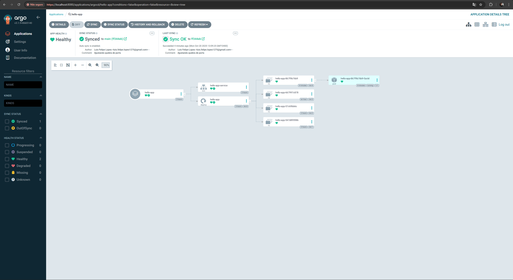
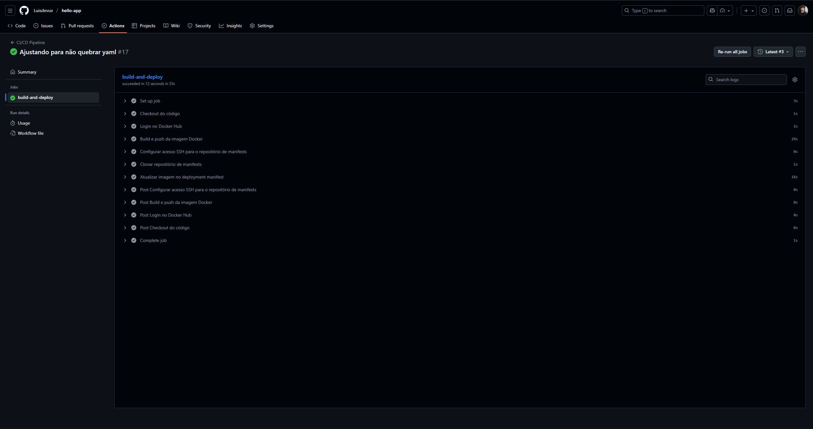
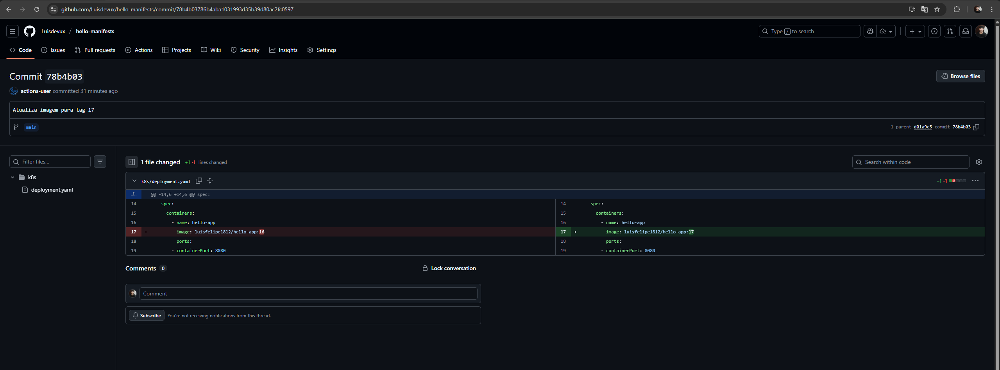
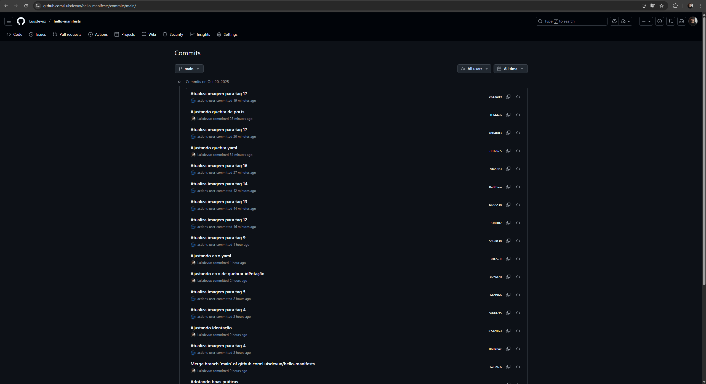
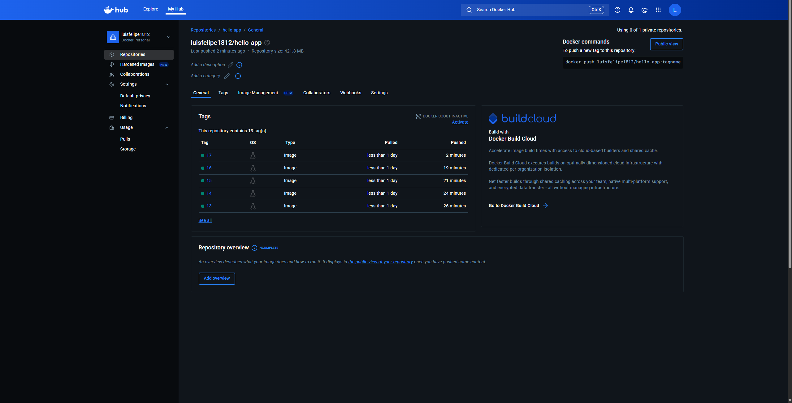
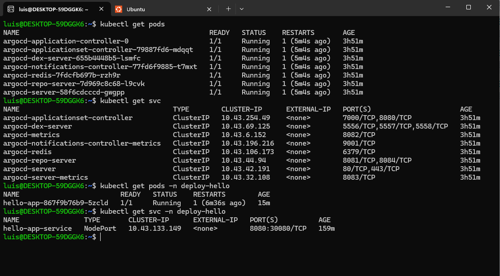
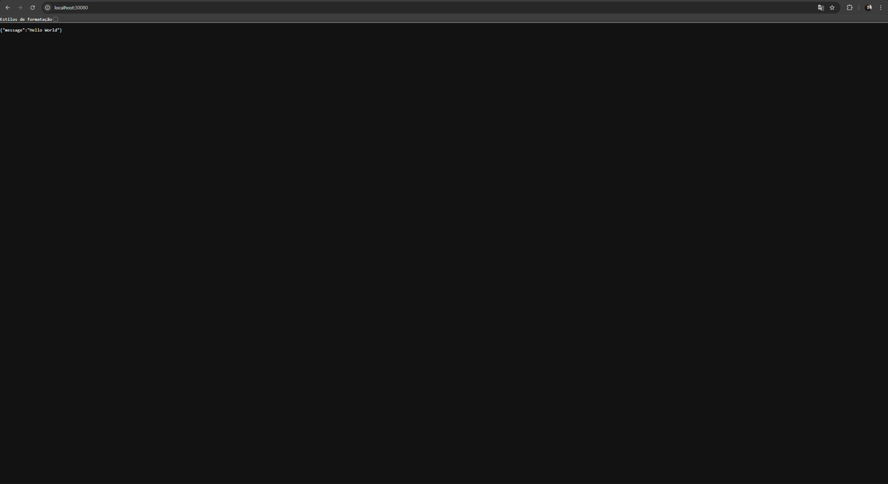

# 🚀 Projeto CI/CD com GitHub Actions, Docker Hub e ArgoCD


[](https://hub.docker.com/r/luisfelipe1812/hello-app)
[](https://hub.docker.com/r/luisfelipe1812/hello-app)
[](https://github.com/Luisdevux/hello-app)


Este projeto implementa um pipeline completo de **Integração Contínua e Entrega Contínua (CI/CD)** para uma aplicação **FastAPI**, utilizando:
- **GitHub Actions** para automação do build e deploy;
- **Docker Hub** como registry de imagens;
- **ArgoCD** para entrega contínua e sincronização GitOps no Kubernetes local via **Rancher Desktop**.
---

## 🎯 Objetivo

Automatizar o ciclo completo de:
1. Desenvolvimento e build da aplicação;
2. Publicação automática no Docker Hub;
3. Atualização dos manifests Kubernetes via commit automático no repositório de manifests;
4. Sincronização e deploy automático via ArgoCD no cluster local.

---

## ⚙️ Stack Utilizada

| Categoria | Ferramenta |
| :--- | :--- |
| **Aplicação** |   |
| **Contêineres** |  |
| **CI/CD** |  |
| **Orquestração** |   |
| **GitOps** |  |
| **Manifestos** |  |

---

## 🏗️ Estrutura do Projeto

```bash
📦 hello-app
┣ 📂 .github/workflows
┃ ┗ 📜 ci-cd.yaml
┗ 📂 img/
┣ 📜 main.py
┣ 📜 Dockerfile
┗ 📜 requirements.txt

📦 hello-manifests
┗ 📂 k8s
┣ 📜 deployment.yaml
┗ 📜 service.yaml
```

---

## 🧠 Descrição das Etapas

### **1️⃣ Aplicação FastAPI**

Arquivo `main.py`:

```python
from fastapi import FastAPI

app = FastAPI()

@app.get("/")
async def root():
    return {"message": "Hello World"}
```

---

### **2️⃣ Dockerfile**

```docker
FROM python:3.9-slim
WORKDIR /app
COPY requirements.txt .
RUN pip install -r requirements.txt
COPY . .
CMD ["uvicorn", "main:app", "--host", "0.0.0.0", "--port", "8080"]
```

---

### **3️⃣ GitHub Actions (CI/CD)**

### O workflow (.github/workflows/ci-cd.yaml) automatiza:
- **Build da imagem Docker;**
- **Push da imagem para o Docker Hub;**
- **Atualização do deployment.yaml no repositório de manifests;**
- **Commit e push automáticos via SSH.**

```yaml
name: CI/CD Pipeline

on: 
  push:
    branches:
        - main

jobs:
    build-and-deploy:
        runs-on: ubuntu-latest

        steps:
            - name: Checkout do código
              uses: actions/checkout@v3

            - name: Login no Docker Hub
              uses: docker/login-action@v3
              with:
                username: ${{ secrets.DOCKER_USERNAME }}
                password: ${{ secrets.DOCKER_PASSWORD }}

            - name: Build e push da imagem Docker
              uses: docker/build-push-action@v5
              with:
                context: .
                push: true
                tags: ${{ secrets.DOCKER_USERNAME }}/hello-app:${{ github.run_number }}

            - name: Configurar acesso SSH para o repositório de manifests privado
              uses: webfactory/ssh-agent@v0.7.0
              with:
                ssh-private-key: ${{ secrets.SSH_PRIVATE_KEY }}
            
            - name: Clonar repositório de manifests
              run: |
                git clone git@github.com:Luisdevux/hello-manifests.git manifests-repo

            - name: Atualizar imagem no deployment manifest
              run: |
                sudo apt-get update && sudo apt-get install -y wget
                wget https://github.com/mikefarah/yq/releases/latest/download/yq_linux_amd64 -O $HOME/yq
                chmod +x $HOME/yq
                sudo mv $HOME/yq /usr/local/bin/yq
                yq --version

                IMAGE_TAG=${{ github.run_number }}
                yq -i ".spec.template.spec.containers[0].image = \"${{ secrets.DOCKER_USERNAME }}/hello-app:${IMAGE_TAG}\"" manifests-repo/k8s/deployment.yaml

                cd manifests-repo
                git config --global user.name "github-actions"
                git config --global user.email "actions@github.com"
                git add k8s/deployment.yaml
                git commit -m "Atualiza imagem para tag ${IMAGE_TAG}" || echo "Nenhuma mudança para commitar"
                git push origin main
```

---

### **4️⃣ Manifests do Kubernetes**:

### Esses arquivos Yaml estão localizados no repositório de manifestos: 

### ➡️ hello-manifests: https://github.com/Luisdevux/hello-manifests.git

### 📄 deployment.yaml

```yaml
apiVersion: apps/v1
kind: Deployment
metadata:
  name: hello-app
spec:
  replicas: 1
  selector:
    matchLabels:
      app: hello-app
  template:
    metadata:
      labels:
        app: hello-app
    spec:
      containers:
        - name: hello-app
          image: luisfelipe1812/hello-app:17
          ports:
            - containerPort: 8080
```

### 📄 service.yaml

```yaml
apiVersion: v1
kind: Service
metadata:
  name: hello-app-service
spec:
  selector:
    app: hello-app
  type: NodePort
  ports:
    - port: 8080
      targetPort: 8080
      nodePort: 30080
```

---

## 5️⃣ ArgoCD

### O **ArgoCD** foi configurado para:

- **Observar o repositório **`hello-manifests`****
- **Sincronizar automaticamente as mudanças no cluster local**
- **Garantir que o estado do cluster reflita o estado do Git (**GitOps**)**

---

### 📸 Interface do ArgoCD


---

## ✅ Evidências do Funcionamento

### A seguir algumas imagens para evidênciar a construção e funcionamento do projeto:

### Pipeline executando com sucesso



---

### Atualização automática do Deployment



---

### Histórico de builds para o hello-manifests



---

### Imagens Atualizadas no DockerHub



---

### Confirmação via Terminal



---

### Aplicação rodando no navegador



---

### 🧩 Resultado Final

Todos os objetivos do projeto foram atingidos:

✅ **CI/CD 100% automatizado com GitHub Actions**  
✅ **Publicação automática no Docker Hub**  
✅ **Atualização dinâmica dos manifests**  
✅ **Sincronização e deploy automático via ArgoCD**   

---

> ### Este projeto está licenciado sob a [Licença MIT](./LICENSE).